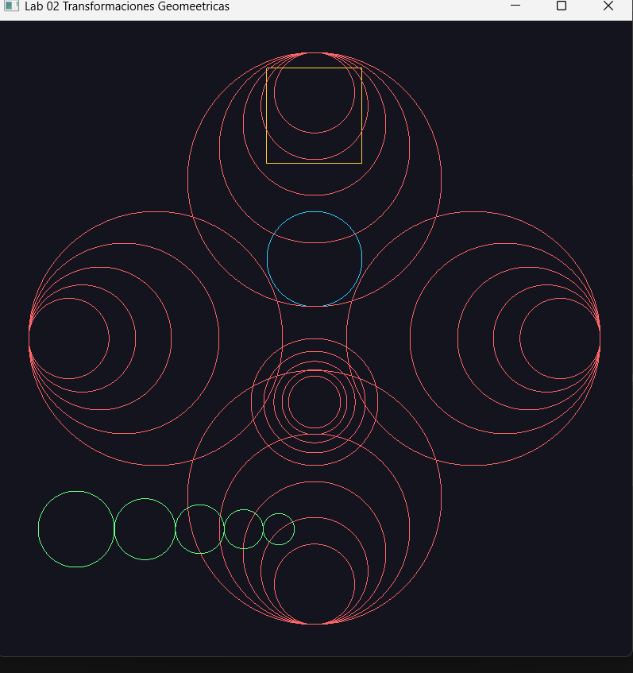
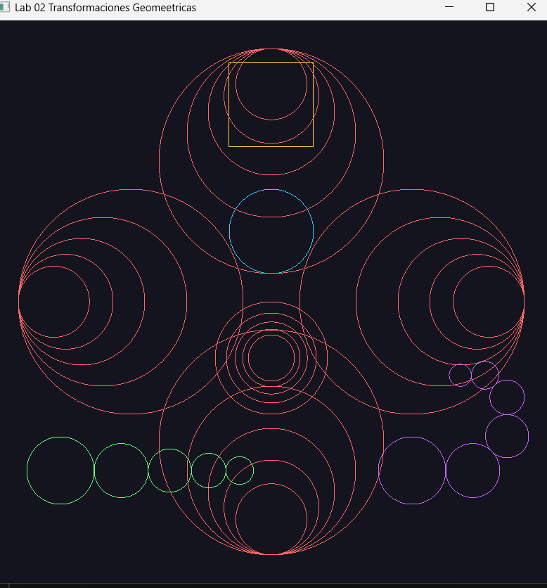

# Lab 02 Transformaciones Geométricas en OpenGL

**Curso:** Computación Gráfica
**Fecha:** 27 de abril de 2026

## Descripción

Implementación manual de primitivas geométricas y secuencias en OpenGL modo inmediato.  
**Restricción:** prohibido usar `glTranslate`, `glRotate`, `glScale`. Todas las coordenadas se calculan directamente.

---

## Archivos

| Archivo | Contenido |
|---------|-----------|
| `shapes.h` | Declaraciones de todas las funciones de dibujo |
| `shapes.cpp` | Implementación matemática de cada función |
| `main.cpp` | Ventana GLFW y llamadas a los ejercicios |

---

## Ejercicios

| #   | Función | Descripción |
|-----|---------|-------------|
| 1   | `drawSquare` | Cuadrado por centro y arista |
| 2   | `drawCircle` | Círculo poligonal por centro, radio y segmentos |
| 3   | `drawCircleSequenceConcentric` | Círculos concéntricos con reducción progresiva |
| 3b  | `drawCircleSequenceConcentricLeft` | Variante: borde izquierdo fijo |
| 3c  | `drawCircleSequenceConcentricRight` | Variante: borde derecho fijo |
| 3d  | `drawCircleSequenceConcentricTop` | Variante: borde superior fijo |
| 3e  | `drawCircleSequenceConcentricBottom` | Variante: borde inferior fijo |
| 4   | `drawCircleSequenceHorizontal` | Círculos tangentes alineados horizontalmente |
| 5   | `drawCircleSequenceSpiral` | Círculos en espiral con ángulo y reducción |
| 5a  | `drawCircleSequenceLine` | Círculos en línea recta con ángulo fijo |
---

## Capturas

### Ejercicio 3 Círculos concéntricos

### Ejercicio 5 Espiral de círculos

---

## Controles

| Tecla | Acción |
|-------|--------|
| `ESC` | Cerrar ventana |