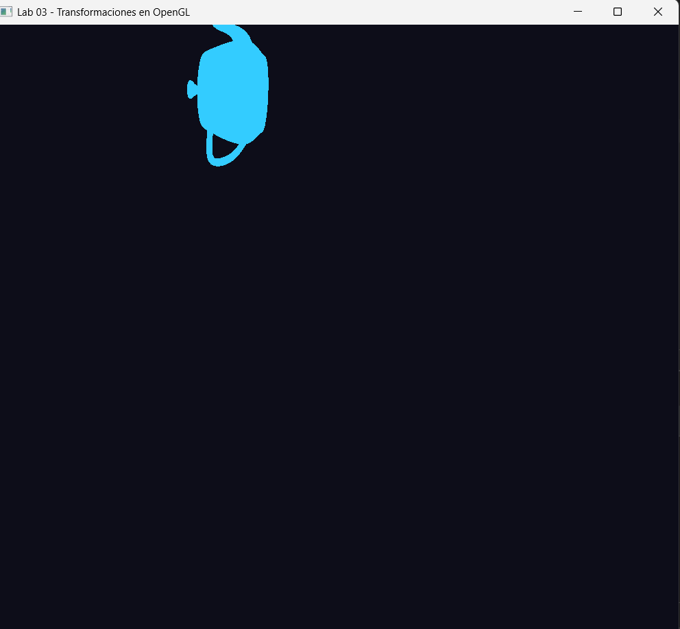
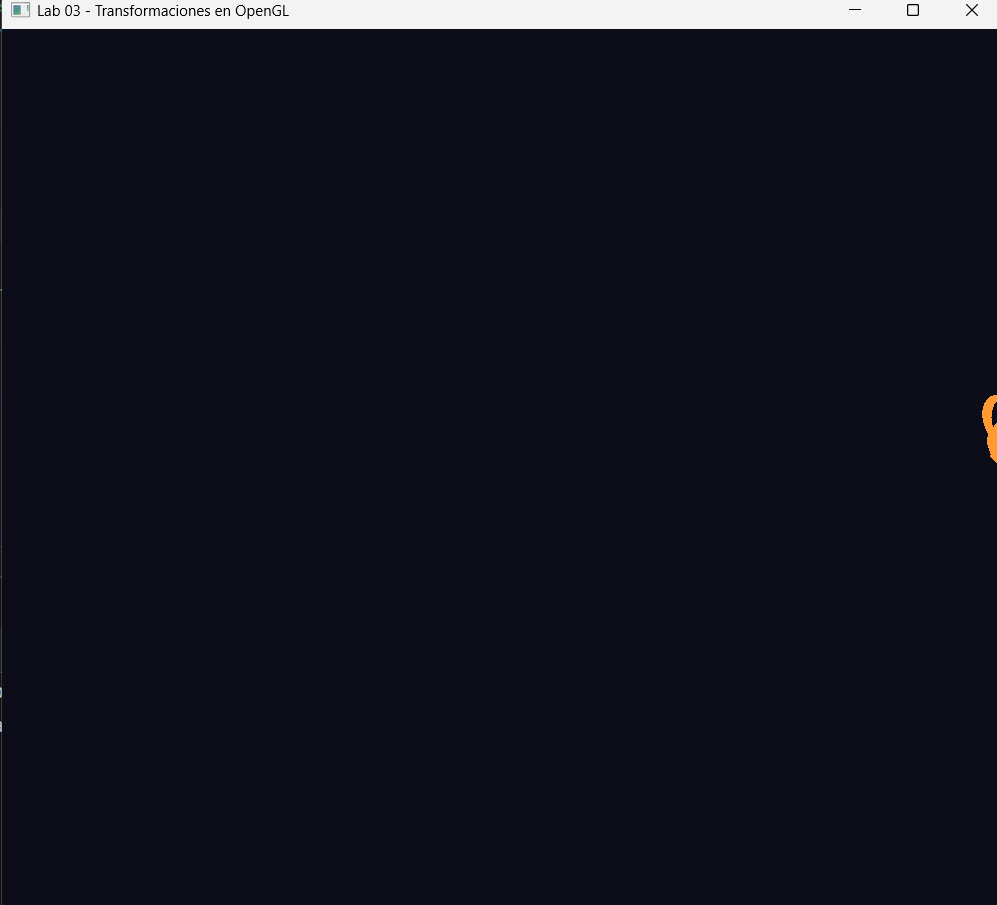
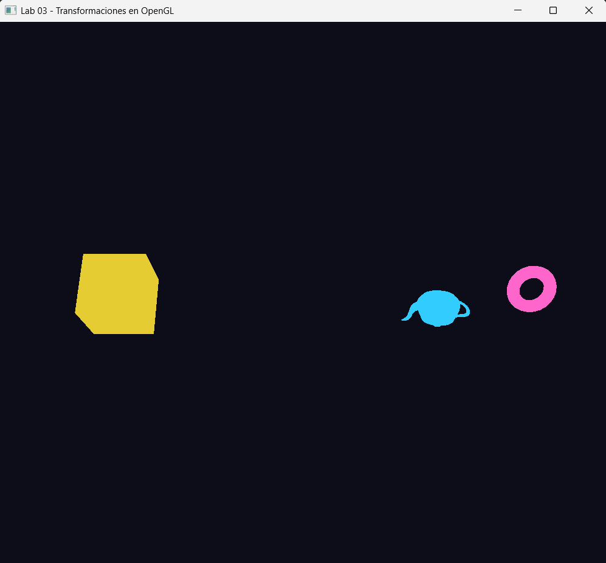
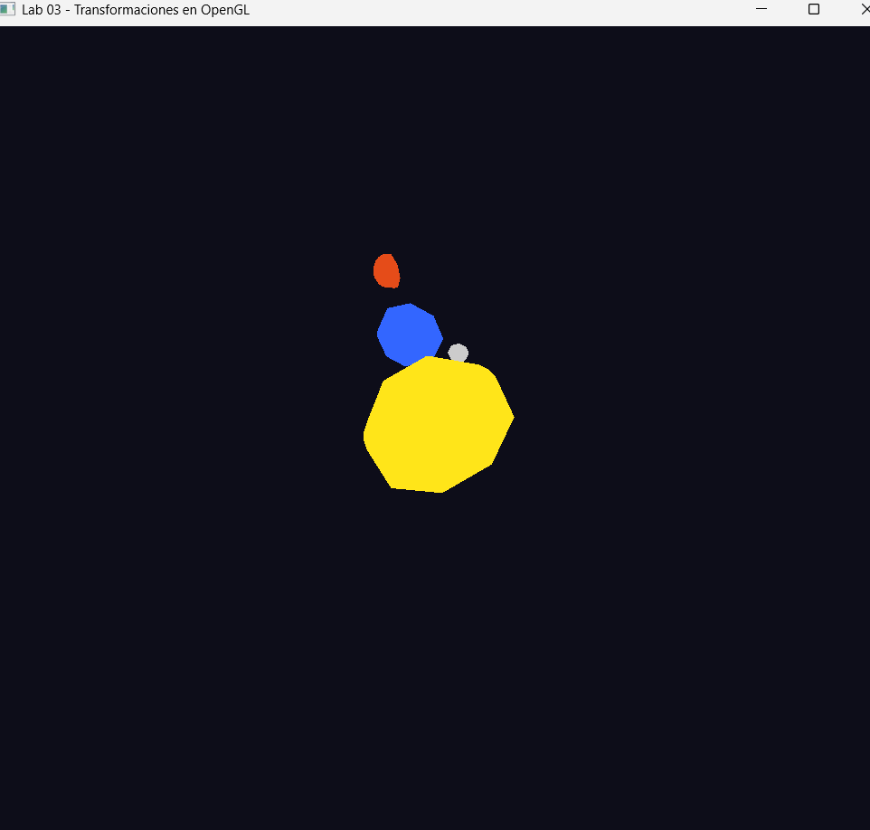

# Lab 03 Transformaciones escena en OpenGL

**Curso:** Computación Gráfica 
**Fecha:** 4 de mayo de 2026

## Descripción

Aplicación de transformaciones geométricas usando las funciones propias de OpenGL (`glTranslatef`, `glRotatef`, `glScalef`), composición de transformaciones y uso de pilas de matrices (`glPushMatrix` / `glPopMatrix`) para modelar escenas jerárquicas animadas.

Sin uso de GLUT las primitivas (esfera, toro, cubo) se implementan manualmente en `primitives.h`.

---

## Archivos

| Archivo | Contenido |
|---------|-----------|
| `main.cpp` | Ventana GLFW, loop de animación y los 4 ejercicios |
| `primitives.h` | Esfera, toro y cubo sin GLUT |
| `OBJLoader.h` | Cargador de archivos `.obj` |
| `Poligono.h/.cpp` | Polígono regular 2D |
| `modelo/teapot.obj` | Modelo de la tetera |

---

## Ejercicios

| # | Descripción |
|---|-------------|
| 1 | Tetera a 4 unidades del origen girando alrededor del eje Z |
| 2 | Tetera con traslación en X de -8 a 8 (ida y vuelta) y rotación propia |
| 3 | Escena compuesta: tetera + toro orbitando (3x más rápido) + cubo independiente |
| 4 | Sistema solar: Sol, Tierra con Luna, y Marte con órbitas y rotaciones propias |

---

## Controles

| Tecla | Acción |
|-------|--------|
| `1` | Ejercicio 1 — Tetera orbitando |
| `2` | Ejercicio 2 — Tetera ida y vuelta |
| `3` | Ejercicio 3 — Escena compuesta |
| `4` | Ejercicio 4 — Sistema solar |
| `ESC` | Cerrar ventana |

---

## Capturas

### Ejercicio 1 — Tetera orbitando

### Ejercicio 2 — Tetera ida y vuelta

### Ejercicio 3 — Escena compuesta

### Ejercicio 4 — Sistema solar

