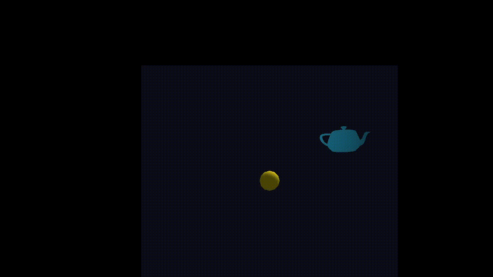
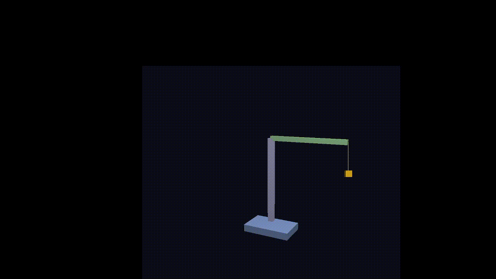
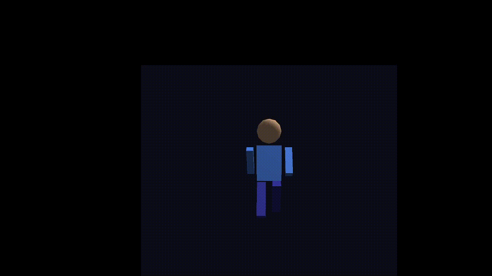
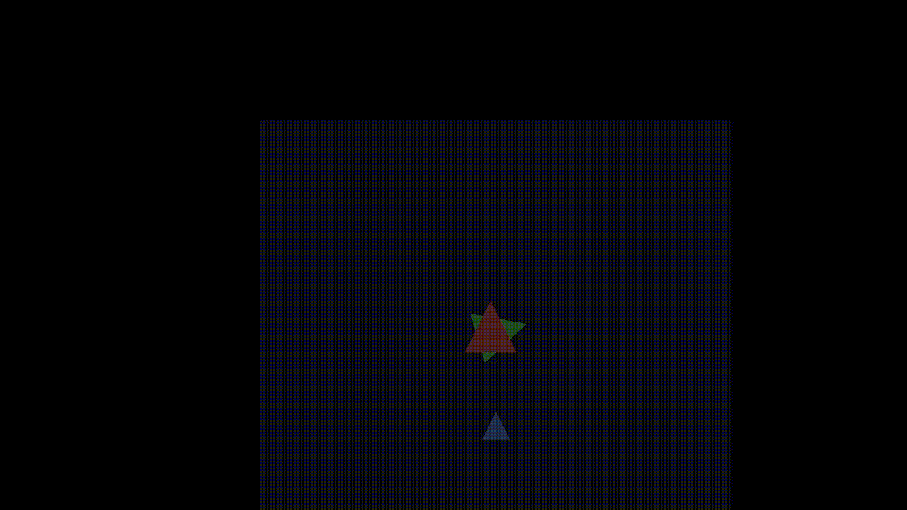
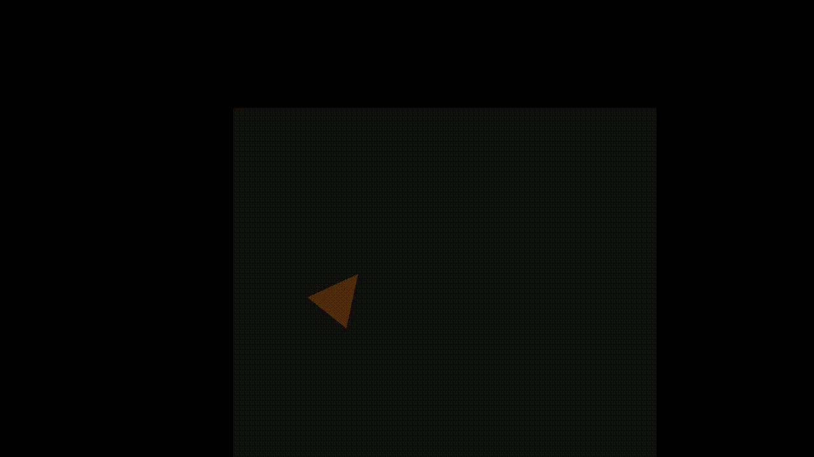

# Lab03 Transformaciones Jerárquicas y Homogéneas

**Curso:** Computación Gráfica
**Fecha:** 11 de mayo de 2026

## Descripción

Aplicación de transformaciones jerárquicas con `glPushMatrix`/`glPopMatrix` y construcción manual de matrices homogéneas 4×4 aplicadas con `glMultMatrixf`. Incluye iluminación `GL_LIGHT0` con normalización de normales para corrección de brillo bajo escalado.

---

## Archivos

| Archivo | Contenido |
|---------|-----------|
| `main.cpp` | Ventana GLFW, loop de animación y selector de escenas |
| `scene_hierarchical.h` | Parte I: tetera corregida, grúa, figura humana |
| `scene_homogeneous.h` | Parte II: matrices homogéneas, composición, rehace lab03 |
| `math_utils.h` | Matrices 4×4 manuales: T, R, S y multiplicación |

> Reutiliza `Primitives.h`, `OBJLoader.h`, `Poligono.h/cpp` y `lighting.h` de `shared/`.

---

## Parte I — Transformaciones Jerárquicas

| Escena | Descripción |
|--------|-------------|
| 1 | Tetera corregida: orbita a distancia constante sin rotar sobre sí misma |
| 2 | Grúa: base rotatoria → columna (α) → brazo horizontal (β) → cuerda y gancho |
| 3 | Figura humana con animación de caminata coordinada |

## Parte II — Transformaciones Homogéneas

| Escena | Descripción |
|--------|-------------|
| 4 | Traslación, rotación y escala aplicadas con `glMultMatrixf` |
| 5 | Composición S·T·R construida manualmente |
| 6 | Lab03 Ej1 rehecho con matrices homogéneas |
| 7 | Lab03 Ej2 rehecho con matrices homogéneas |
| 8 | Lab03 Ej3 rehecho con matrices homogéneas |

---

## Controles

| Tecla | Acción |
|-------|--------|
| `1` – `8` | Cambiar escena |
| `A` / `D` | Rotar base de la grúa (escena 2) |
| `W` / `S` | Inclinar columna α (escena 2) |
| `Q` / `E` | Inclinar brazo β (escena 2) |
| `Z` / `X` | Subir / bajar gancho (escena 2) |
| `ESC` | Cerrar ventana |

---

## Nota técnica — GL_NORMALIZE

Al usar `glScalef` con escalados no uniformes, OpenGL escala también las normales de los vértices. Una normal con longitud distinta de 1 distorsiona el cálculo de iluminación produciendo superficies sobreiluminadas o blanquecinas. `glEnable(GL_NORMALIZE)` indica a OpenGL que renormalice automáticamente cada normal antes del cálculo de luz, corrigiendo el efecto sin cambiar los colores definidos.

---

## Capturas

### Escena 1 — Tetera corregida

### Escena 2 — Grúa jerárquica

### Escena 3 — Figura humana

### Escena 4 — T/R/S con matrices

### Escena 5 — Composición manual

