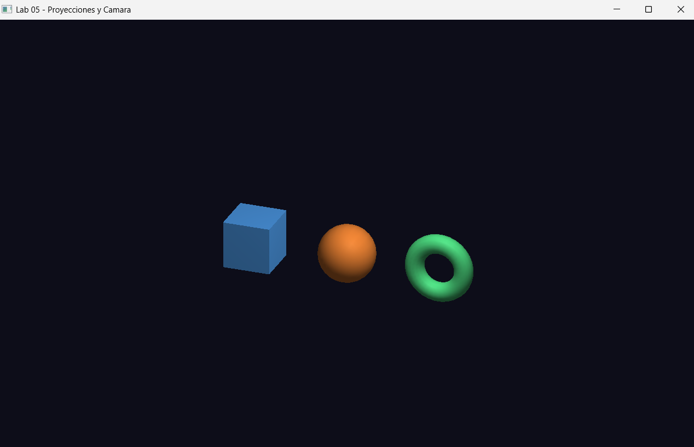
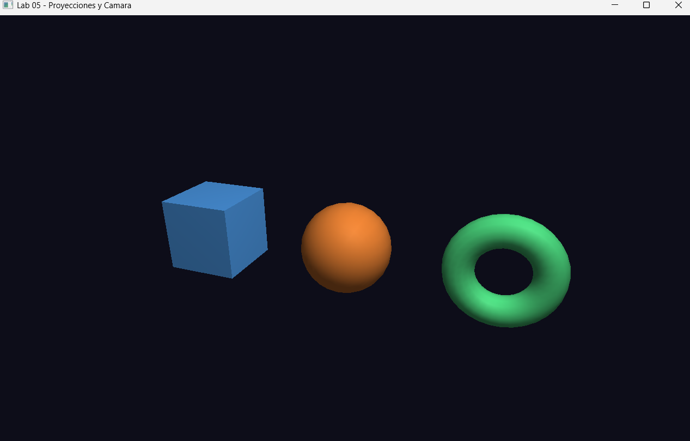
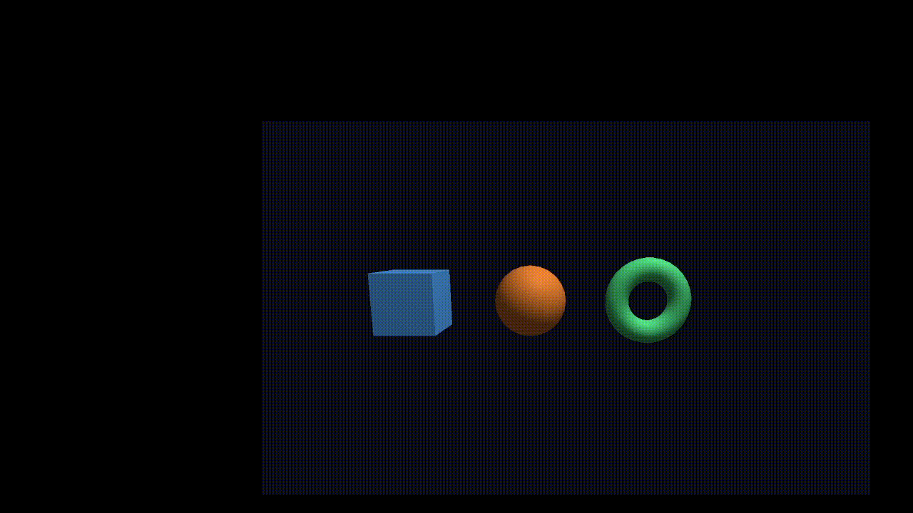
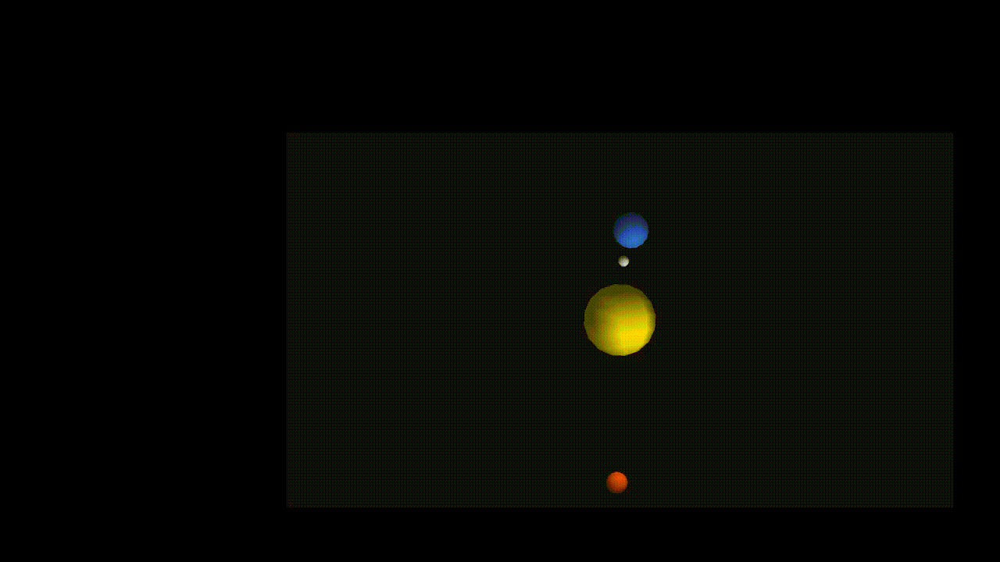
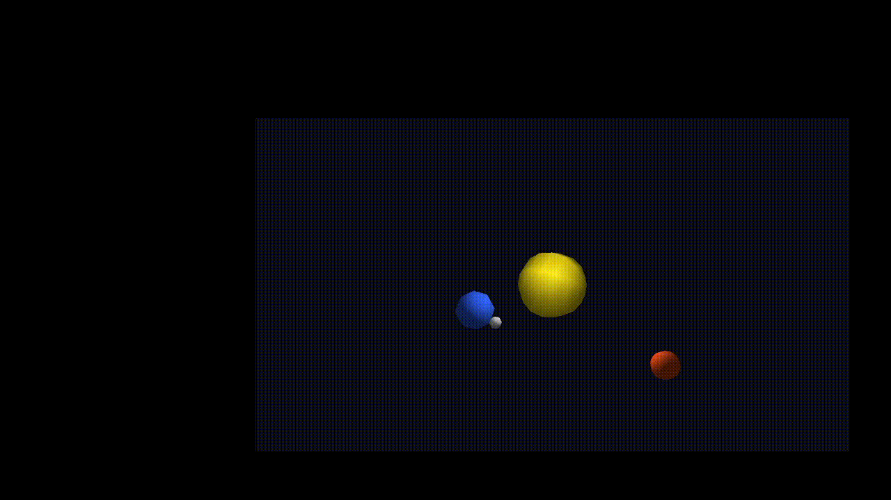
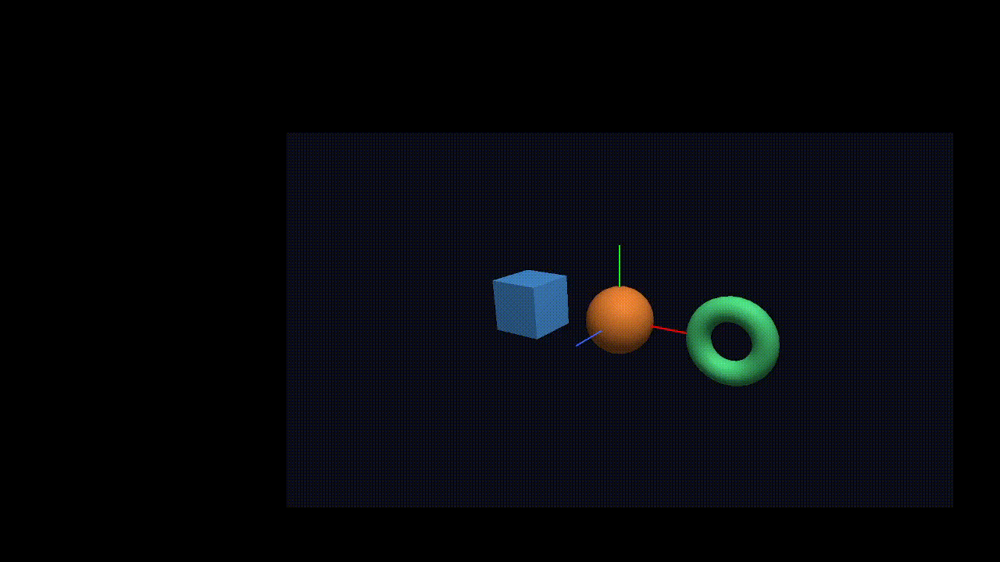

# Laboratorio 05 Proyecciones y Cámara en OpenGL

**Curso:** Computación Gráfica
**Fecha:** 18 de mayo de 2026

## Descripción

Implementación y comparación de proyecciones ortográfica y perspectiva, cámara libre controlada por teclado, seguimiento automático de un objeto con `gluLookAt`, cámara trackball con mouse y gizmo de ejes de referencia.

---

## Archivos

| Archivo | Contenido |
|---------|-----------|
| `main.cpp` | Ventana GLFW, callbacks de teclado y mouse, selector de escenas |
| `camera.h` | `FreeCamera`, `Trackball` y `drawGizmo` |
| `scenes.h` | Las 5 escenas, proyecciones, `Body`, `SolarView` y `drawBody` |

> Reutiliza `Primitives.h` y `lighting.h` de `shared/`.

---

## Ejercicios

| Escena | Descripción |
|--------|-------------|
| 1 | Proyección ortográfica con `glOrtho` |
| 2 | Proyección perspectiva con `gluPerspective` |
| 3 | Cámara libre controlada por teclado |
| 4 | Sistema solar con cámara siguiendo a la Tierra (3 modos de vista) |
| 5 | Cámara trackball con mouse + gizmo de ejes XYZ |

---

## Controles

| Tecla / Mouse | Acción |
|---------------|--------|
| `1` | Proyección ortográfica |
| `2` | Proyección perspectiva |
| `3` | Cámara libre |
| `4` | Sistema solar |
| `5` | Trackball + gizmo |
| `V` | Cambiar vista del sistema solar (sigue Tierra → cenital → libre) |
| `A` / `D` | Mover cámara izquierda / derecha (escena 3) |
| `W` / `S` | Mover cámara arriba / abajo (escena 3) |
| `Q` / `E` | Acercar / alejar (escena 3) |
| Mouse izq + arrastrar | Rotar escena (escena 5) |
| Rueda del mouse | Zoom (escena 5) |
| `ESC` | Cerrar ventana |

---

## Capturas

### Escena 1 — Proyección ortográfica

### Escena 2 — Proyección perspectiva

### Escena 3 — Cámara libre

### Escena 4 — Sistema solar (siguiendo Tierra)

### Escena 4 — Sistema solar (vista cenital)

### Escena 4 — Sistema solar (vista libre)

### Escena 5 — Trackball + gizmo

