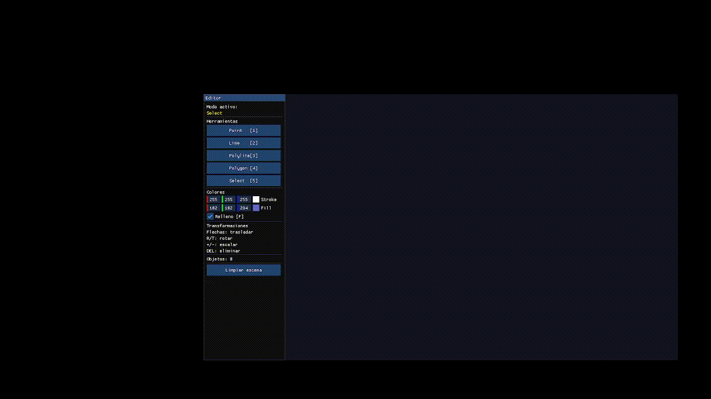

# Laboratorio 06 Editor Gráfico 2D en OpenGL

**Curso:** Computación Gráfica 
**Fecha:** 25 de mayo de 2026

## Descripción

Editor gráfico 2D interactivo con panel lateral (Dear ImGui). Permite crear, seleccionar y transformar primitivas geométricas usando mouse y teclado. Las transformaciones se aplican mediante matrices homogéneas construidas manualmente.

---

## Dependencias adicionales
Se descargo de https://github.com/ocornut/imgui/releases la versión 1.92.8 de ImGui, que es la que se usó para el desarrollo del proyecto.

El repositorio tiene en la ruta: 
```bash
external/imgui/
```
la versión de ImGui que se usó para el desarrollo.

Y tambien imgui-1.92.8 en la raiz del proyecto, ahi estan todas las funciones.

---

## Arquitectura

| Archivo | Responsabilidad |
|---------|----------------|
| `main.cpp` | Ventana GLFW, callbacks, loop principal, panel ImGui |
| `Editor.h` | Lógica central: modos, construcción de figuras, transformaciones |
| `Scene.h` | Almacenamiento, selección y gestión de objetos |
| `Shape.h` | Jerarquía de clases + Factory |
| `math_utils.h` | Matrices homogéneas 4×4 (de `shared/`) |

### Jerarquía de clases

```
Shape  (abstracta)
├── PointShape
├── LineShape
├── PolylineShape
└── PolygonShape

ShapeFactory::create(ShapeType) -> unique_ptr<Shape>
```

---

## Herramientas

| Tecla | Herramienta |
|-------|-------------|
| `1` | Punto |
| `2` | Línea (2 clics) |
| `3` | Polilínea (Enter para finalizar) |
| `4` | Polígono (clic derecho para cerrar) |
| `5` | Selección |

---

## Controles

| Tecla / Mouse | Acción |
|---------------|--------|
| Clic izquierdo | Agregar vértice / seleccionar |
| Clic derecho | Cerrar polígono / cancelar |
| `Enter` | Finalizar polilínea |
| `DEL` | Eliminar objeto seleccionado |
| `F` | Activar/desactivar relleno |
| Flechas | Trasladar objeto seleccionado |
| `R` / `T` | Rotar objeto seleccionado |
| `+` / `-` | Escalar objeto seleccionado |
| `ESC` | Salir |

---

## Capturas

### Panel y herramienta de puntos


### Líneas


### Polilíneas


### Polígonos con relleno


### Selección y transformaciones


### Escena final



