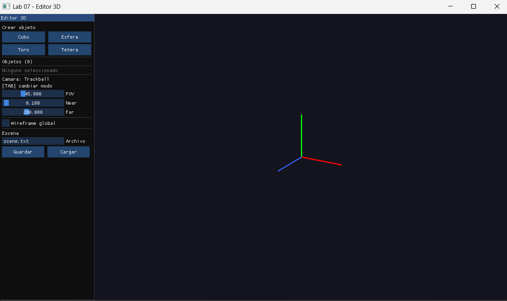
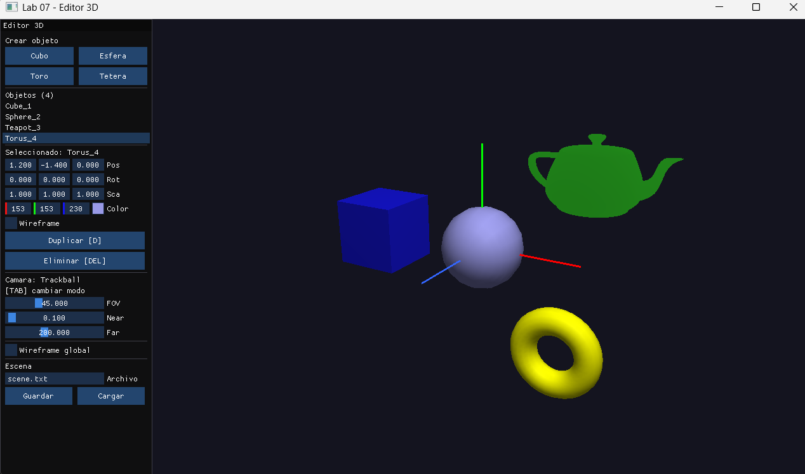
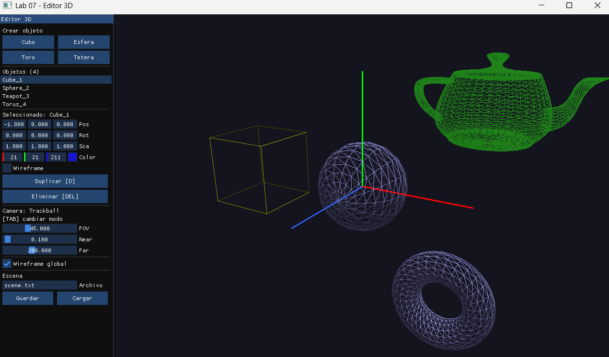
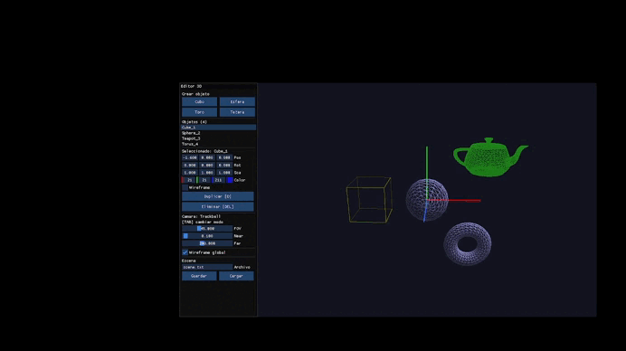

# Laboratorio 07 Editor Gráfico 3D en OpenGL

**Curso:** Computación Gráfica
**Fecha:** 7 de junio de 2026

## Descripción

Editor gráfico 3D interactivo con panel lateral ImGui. Permite crear, seleccionar, transformar, duplicar y eliminar objetos 3D. Incluye cámara trackball y libre, gizmo de ejes, proyección configurable y guardar/cargar escenas.

---

## Arquitectura

| Archivo | Responsabilidad |
|---------|----------------|
| `main.cpp` | Ventana, callbacks, loop, panel ImGui, gizmo |
| `Object3D.h` | Objeto 3D con transformaciones y serialización |
| `Scene3D.h` | Almacenamiento, selección, duplicar, guardar/cargar |
| `Camera3D.h` | Cámara libre y trackball con FOV configurable |

> Reutiliza `Primitives.h`, `OBJLoader.h` y `lighting.h` de `shared/`.

---

## Objetos disponibles

| Tipo | Primitiva |
|------|-----------|
| Cubo | `drawCube` |
| Esfera | `drawSphere` |
| Toro | `drawTorus` |
| Tetera | `OBJLoader` |

---

## Controles

| Tecla / Mouse | Acción |
|---------------|--------|
| Panel → botones | Crear objetos |
| Panel → lista | Seleccionar objeto |
| Flechas | Trasladar en X/Y |
| `PgUp` / `PgDn` | Trasladar en Z |
| `X` / `Y` / `Z` | Rotar en cada eje |
| `=` / `-` | Escalar uniformemente |
| `D` | Duplicar objeto seleccionado |
| `DEL` | Eliminar objeto seleccionado |
| `TAB` | Cambiar entre cámara Trackball y Libre |
| Botón derecho + arrastrar | Rotar escena (Trackball) |
| Rueda del mouse | Zoom |
| `W` / `S` | Mover cámara arriba/abajo (Libre) |
| `A` / `E` | Mover cámara izquierda / zoom in (Libre) |
| `Q` | Zoom out (Libre) |
| `ESC` | Salir |

* La tecla Del suele ser 'Delete' o 'Supr' dependiendo del teclado.
* Las teclas PgUp y PgDn suelen ser 'Page Up' y 'Page Down' respectivamente.
* Las teclas PgUp y PgDn tambien suelen ser 'Repag' = 'Page Up' y 'AvPag' = 'Page Down' respectivamente.
---

## Características adicionales

- **Wireframe por objeto** checkbox individual en el panel
- **Wireframe global** activa modo alámbrico para toda la escena
- **Duplicar** crea una copia del objeto seleccionado con offset
- **Guardar/Cargar** serializa la escena en un archivo de texto plano

---

## Capturas

### Vista general del editor

### Objetos con distincion de colores

### Modo wireframe

### Cámara trackball inspeccionando la escena

### Demostracion final de todo el funcionamiento
