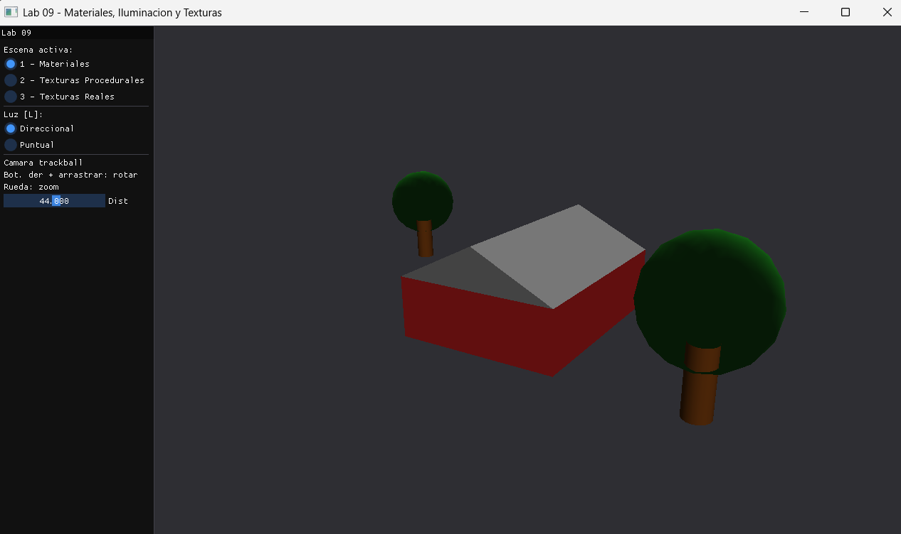
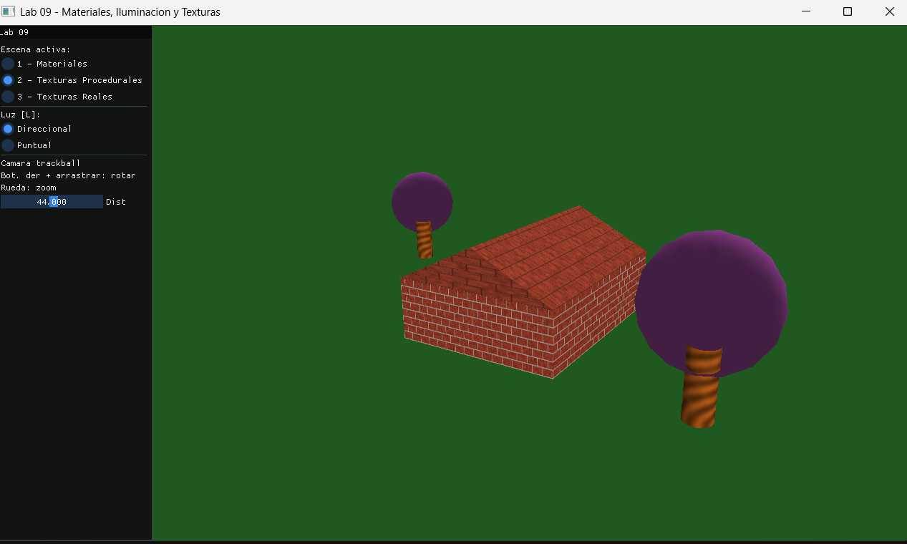
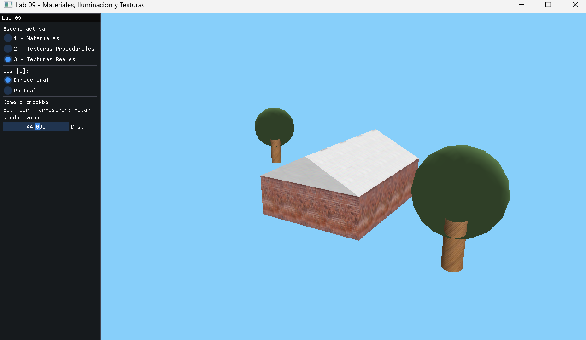
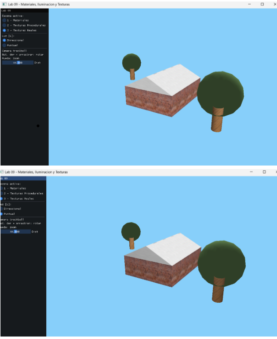

# Laboratorio 09: Materiales, Iluminación y Texturas
**Curso:** Computación Gráfica
**Fecha:** 15 de junio de 2026

## Descripción

Escena 3D (casa + árbol + terreno) renderizada en tres modos comparables: solo materiales, texturas procedurales y texturas reales. Incluye iluminación configurable (direccional/puntual) y cámara trackball.

---

## Arquitectura

| Archivo | Responsabilidad |
|---------|----------------|
| `main.cpp` | Ventana, trackball, panel ImGui, loop |
| `Scene.h` | Clase base abstracta con geometría compartida |
| `SceneMaterials.h` | Escena 1: solo materiales GL |
| `SceneProcedural.h` | Escena 2: texturas generadas en código |
| `SceneTextured.h` | Escena 3: texturas desde archivo con stb_image |
| `Geometry.h` | Terreno, casa, árbol, cilindro |
| `Material.h` | Struct Material + namespace Materials |
| `TextureManager.h` | Carga con stb_image + generadores procedurales |

> Reutiliza `Primitives.h` y `lighting.h` de `shared/`.
> Requiere `external/stb/stb_image.h`.

---

## Texturas reales (Escena 3)

Coloca los archivos en `lab09-materiales-iluminacion-textura/textures/`:

```
textures/
├── grass.jpg
├── brick.jpg
├── tile.jpg
├── wood.jpg
└── leaves.jpg
```

Si algún archivo no se encuentra, la escena hace fallback automático a la versión procedural.

---

## Controles

| Tecla / Mouse | Acción                             |
|---------------|------------------------------------|
| `1` | Escena 1: Materiales               |
| `2` | Escena 2: Texturas procedurales    |
| `3` | Escena 3: Texturas reales          |
| `L` | Alternar luz direccional / puntual |
| Botón derecho + arrastrar | Rotar cámara                       |
| Rueda del mouse | Zoom                               |
| `ESC` | Salir                              |

---

## Capturas

### Escena 1 Solo materiales


### Escena 2 Texturas procedurales


### Escena 3 Texturas reales


### Comparación luz direccional vs puntual


> Coloca tus capturas en `lab09-materiales-iluminacion-textura/screenshots/`.
