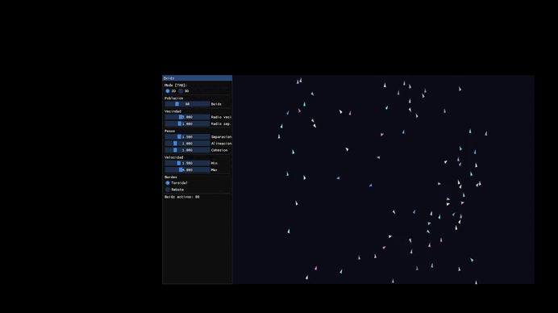
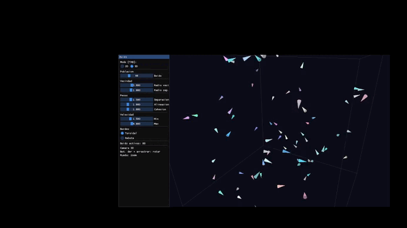

# Laboratorio 10: Comportamiento Colectivo

**Curso:** Computación Gráfica
**Fecha:** 22 de junio de 2026

## Descripción

Simulación del modelo Boids de Craig Reynolds con las tres reglas clásicas (separación, alineación, cohesión) implementadas tanto en 2D como en 3D. Todos los parámetros son ajustables en tiempo real desde el panel ImGui.

---

## Arquitectura

| Archivo | Responsabilidad |
|---------|----------------|
| `Vec.h` | Vectores `Vec2` y `Vec3` con operaciones matemáticas |
| `Boid.h` | Structs `Boid2D` y `Boid3D` con posición, velocidad y aceleración |
| `BoidSystem.h` | Lógica de separación, alineación, cohesión + `BoidParams` |
| `BoidRenderer2D.h` | Dibujo 2D con triángulo orientado por dirección |
| `BoidRenderer3D.h` | Dibujo 3D con cono orientado + cámara trackball + caja de límites |
| `main.cpp` | Ventana, loop, ImGui, selector 2D/3D |

---

## Reglas implementadas

| Regla | Descripción |
|-------|-------------|
| Separación | Repulsión entre Boids demasiado cercanos |
| Alineación | Cada Boid iguala su dirección al promedio de sus vecinos |
| Cohesión | Cada Boid se mueve hacia el centro de masa de sus vecinos |

---

## Controles

| Tecla / Mouse | Acción |
|---------------|--------|
| `TAB` | Alternar entre modo 2D y 3D |
| Bot. derecho + arrastrar | Rotar cámara (modo 3D) |
| Rueda | Zoom (modo 3D) |
| Panel ImGui | Ajustar todos los parámetros en tiempo real |
| `ESC` | Salir |

---

## Parámetros ajustables

- Número de Boids (10 - 300)
- Radio de vecindad
- Radio de separación
- Peso de separación, alineación y cohesión
- Velocidad mínima y máxima
- Comportamiento en bordes: toroidal o rebote

---

## Capturas

### Modo 2D : bandada en formación

### Modo 3D : enjambre con caja de límites

### Comparación toroidal vs rebote

